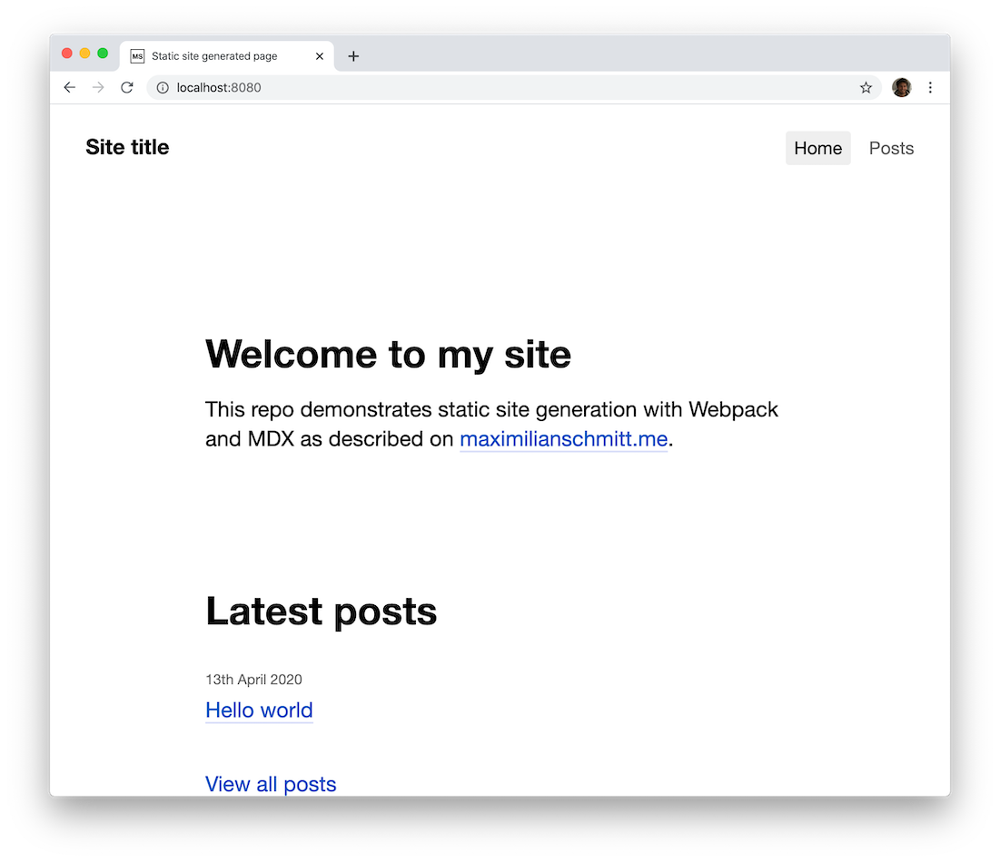

# Static site generator example



As described in the post ["Writing a static site generator with MDX & Webpack"](https://maximilianschmitt.me/posts/mdx-webpack-static-site-generator/).

## Getting started

⚠️ Requires node 13

```
$ git clone git@github.com:maximilianschmitt/static-site-generator-example.git
$ cd static-site-generator-example
$ yarn
$ yarn dev
$ open http://localhost:8080
```

## Repository overview

```
# Markdown content goes into the `content` directory. URL structure
# follows the directory structure of the files. You can also export
# React components here to create pages/posts.
content/

# Everything concerning the build / dev process lives in the `framework`
# directory.
framework/

# General-purpose static assets like favicons can be placed in the `static`
# folder. Gets served under `/static`.
static/

# Reusable UI components
components/

# Reusable layout components
layouts/
```

## Understanding the code

You'll probably have the easiest time if you start reading the code at the entry point for the build / dev process is `framework/bin.js`.

I haven't added any code comments or documentation, so it might be a little hard to navigate this project.
